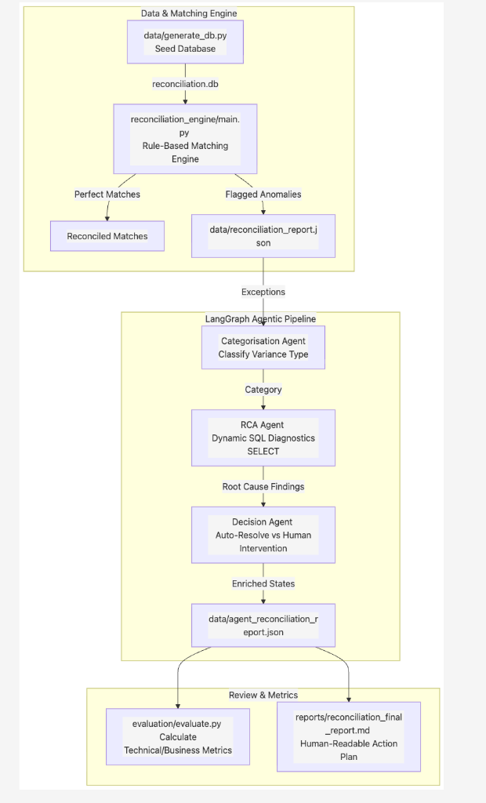

# Credit Card & Bank Reconciliation

This repository provides a realistic, modular testing sandbox for developing and benchmarking **Agentic AI systems** in retail payments, banking, and general ledger reconciliation. 

It contains a generated SQLite database populated with 3 months of synthetic financial data, together with a deterministic, rule-based matching engine that achieves high reconciliation accuracy while identifying key business anomalies.

---

## Reconciliation & Agentic Workflow

The diagram below maps the end-to-end transaction generation, rule-based matching, and agent-driven anomaly analysis pipeline:



### Demo Video

Here is a quick walkthrough video demonstrating the reconciliation workspace and agentic workflow in action:

<video src="assets/reconcilliation_agentic_ai.mp4" width="100%" controls></video>

*If the video does not play in your markdown reader, you can view the file directly: [reconcilliation_agentic_ai.mp4](assets/reconcilliation_agentic_ai.mp4)*

### End-to-End Steps:
1. **Database Seeding (`data/generate_db.py`)**: Deterministically seeds the SQLite database (`reconciliation.db`) containing checking, card, and ledger transactions with specific pre-configured discrepancies (lags, tips, currency differences, potential fraud).
2. **Rule-Based Pre-Matching (`reconciliation_engine/main.py`)**: Filters out perfect matches, merchant name DBA resolving, and multi-currency matches, exporting all unresolved variances to `data/reconciliation_report.json`.
3. **Agentic Exception Handling (`agentic_reconciliation/main.py`)**:
   * **Categorisation**: Classifies the exceptions into specific accounting categories.
   * **Root Cause Analysis (RCA)**: Connects to the database safely (read-only) in a ReAct loop to inspect date ranges, currency exchange rates, subtotals (tips), or duplicate listings.
   * **Decision**: Decides if the discrepancy is `AUTO_RESOLVED` (generating adjustments) or `REQUIRES_HUMAN_INTERVENTION` (e.g. employee missing receipt, potential fraud card locks).
4. **Enriched Results Export**: Outputs details to `data/agent_reconciliation_report.json`.
5. **System Evaluation (`evaluation/evaluate.py`)**: Automatically computes technical and business metrics (reduction in manual work, fraud exposure prevented, categorisation accuracy, and tool use counts), writing them to `evaluation/evaluation_report.md`.
6. **Business Reporting (`reports/reconciliation_final_report.md`)**: Synthesizes the exact actions the accounting team must perform to close the month's books.

---

## Observability & LangSmith Tracing

Observability is a critical capability in the sandbox, ensuring that LLM decisions, query metrics, and agent logic flows are 100% transparent and auditable. 

* **StateGraph Visualization**: The entire LangGraph pipeline execution is traced step-by-step.
* **Full Audit Spans**: Every tool invocation (e.g., executing read-only database queries) is recorded with raw SQL inputs and returned rows.
* **Visual Tracing**: When `LANGCHAIN_TRACING_V2` is configured in `.env`, the system automatically gathers trace run metrics and saves their URLs under `agent_langsmith_trace_url` in the final reports.
* **Direct UI Links**: The interactive frontend displays these live LangSmith trace graphs directly in the exception detail view for developers to inspect prompts, inputs, outputs, and token/latency profiles in real-time.

---

## Evaluation Suite

The testing sandbox includes an automated evaluation suite (`evaluation/evaluate.py`) that scores the agent's performance against the ground truth anomalies to ensure safety before sandbox adjustments are pushed to production.

Key evaluation metrics measured:
1. **Categorisation Accuracy**: Ratio of agent's classification matches (e.g., Timing Lag, Missing Entry, Fraud) to the real anomaly cause.
2. **Workload Reduction Ratio (%)**: The percentage of exceptions that were auto-resolved safely by the AI agents relative to the total exception count.
3. **Contextual Relevancy & Recall**:
4. **Tool Call Accuracy**:

---

## Directory Structure

```
├── .env                          # Local environment secrets and LLM keys
├── .env.example                  # Template environment variables
├── requirements.txt              # Package dependencies for agents and data processes
├── venv/                         # Python virtual environment (auto-created)
├── data/
│   ├── README.md                 # Database schema details and test case list
│   ├── generate_db.py            # SQLite database generation script
│   └── reconciliation.db         # Synthetic SQLite database (Apr - Jun 2026 data)
├── reconciliation_engine/
│   ├── README.md                 # Reconciliation matching pipeline stages guide
│   ├── database.py               # Database client mapping SQLite to dictionaries
│   ├── normalizers.py            # DBA resolvers, text cleaners, and fuzzy matchers
│   ├── reconciliation.py         # Multi-stage matching pipelines (card & bank)
│   └── main.py                   # Engine CLI pipeline runner and reporting dashboard
├── agentic_reconciliation/
│   ├── README.md                 # Documentation of agents (Categorisation, RCA, Decision)
│   ├── state.py                  # LangGraph state definition
│   ├── graph.py                  # StateGraph layout and node definitions
│   ├── main.py                   # CLI agent runner and report enricher
│   ├── agents/                   # Agents submodules (categorisation, rca, decision)
│   └── tools/                    # Read-only database querying tool
├── evaluation/
│   ├── README.md                 # Documentation of metrics accounted for
│   ├── evaluate.py               # Performance evaluation script
│   └── evaluation_report.md      # Detailed findings and performance statistics report
└── reports/
    └── reconciliation_final_report.md # Final human-readable report for accounting team
```

---

## Getting Started

### 1. Environment Setup

The workspace is configured with a virtual environment (`venv`) and package dependencies. To activate it and initialize environment files:

```bash
# Activate virtual environment
source venv/bin/activate

# Copy the example environment file
cp .env.example .env
```

Open `.env` and configure your API keys. To run the live agentic workflow on Groq, configure your `GROQ_API_KEY`:
```env
GROQ_API_KEY=gsk_...
```
*Note: If no `GROQ_API_KEY` is present, the pipeline defaults to **Dry-Run Simulation Mode** which plays back pre-cached agent responses but executes the actual database lookup queries in real-time.*

### 2. Regenerating the Data

If you need to reset the sandbox or regenerate the database seed data, run:

```bash
python3 data/generate_db.py
```
*Note: This script dynamically generates all transactions and calculates statement balances to create a closed payment loop between the checking account and the corporate credit card.*

### 3. Running the Reconciliation Engine

Execute the rule-based matching engine runner to reconcile checking and credit card statements:

```bash
PYTHONPATH=. python3 reconciliation_engine/main.py
```

This runner will output a complete CLI reporting dashboard and export a structured JSON report to `data/reconciliation_report.json` with details of all resolved matches and identified anomalies.

### 4. Running the LangGraph Agentic Pipeline

Once the engine flags discrepancies, run the LangGraph-based agentic pipeline to categorize issues, perform database-driven Root Cause Analysis (RCA), and render final decisions on automated resolution or human intervention:

```bash
python3 -m agentic_reconciliation.main
```
This script will print colored execution logs detailing each agent's findings, log diagnostic database queries, and save the enriched report to `data/agent_reconciliation_report.json`.

To process a single discrepancy ID (for debugging):
```bash
python3 -m agentic_reconciliation.main --id <discrepancy_id>
```

### 5. Running the Performance Evaluation

To measure the agent pipeline's accuracy, query efficiency, manual workload reduction, and fraud exposure prevention:

```bash
python3 evaluation/evaluate.py
```
This script displays the performance report directly in the console. The findings are saved locally in [evaluation_report.md](file:///Users/aryankasat/Documents/Aryan/Codes/Financial-Reconcilliation-Agentic-AI/evaluation/evaluation_report.md).

### 6. Reviewing Accounting Action Reports

A human-readable summary detailing each discrepancy, its root cause, and concrete journal entries or security steps for the accounting team can be viewed at [reconciliation_final_report.md](file:///Users/aryankasat/Documents/Aryan/Codes/Financial-Reconcilliation-Agentic-AI/reports/reconciliation_final_report.md).

---

## Model Context Protocol (MCP) Database Server

This repository includes a Model Context Protocol (MCP) server that exposes the SQLite database to external AI clients (e.g., Claude Desktop, Cursor IDE). This allows your external assistant to dynamically run safe database queries, inspect schemas, and preview tables.

### Exposed Tools:
* **`run_query`**: Executes a read-only `SELECT` query safely on the database.
* **`list_tables`**: Lists all tables (`accounts`, `ledger_entries`, `bank_statement_lines`, `card_statement_lines`) in the database.
* **`get_table_schema`**: Retrieves the column details (data types, primary keys, nullability) for a given table.
* **`preview_table`**: Previews the first N records (up to 200) from any table.

### Running the Server Locally:
To start the MCP server on standard input/output (stdio) using the virtual environment:
```bash
./venv/bin/python mcp_server.py
```
---

## Reconciliation Test Cases (Anomalies)

The sandbox database contains specific, pre-configured financial anomalies that must be identified by matching pipelines or AI agents:

1. **Merchant DBA Normalization**: Mapping statement legal/corporate names (e.g., `Formagrid Inc`, `Agilebits Inc`, `WW Operating LLC`) to brand names (`Airtable`, `1Password`, `WeWork`).
2. **Timing Differences**: Outstanding entries booked in the ledger in late June that clear bank/credit statements in early July.
3. **Missing Ledger Entries**: Unrecorded statement lines (e.g., employee did not submit a receipt).
4. **Amount Discrepancies**: Discrepancies resulting from credit card tips, conversion rates, or manual typing errors (e.g., manual Chipotle lunch booking vs. actual card swipe amount).
5. **Duplicate Entries**: Duplicate bookings in the general ledger representing the same physical charge.
6. **Unrecognized Charges (Fraud)**: Unregistered high-value statement transactions (e.g., `$450.00` charge at `Electronics Direct`).
7. **Multi-Currency Alignment**: Transactions billed in USD but processed in foreign currencies (EUR, GBP, CAD) containing foreign amount metadata.

---
