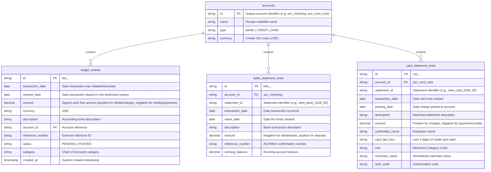

# Financial Reconciliation Database (`reconciliation.db`)

This folder contains the SQLite database and seed generation script for testing and training an agentic financial reconciliation system.

## Folder Contents
1. **`reconciliation.db`**: The SQLite database file containing generated accounts, ledger entries, bank statement lines, and credit card statement lines.
2. **`generate_db.py`**: A seeded, deterministic Python script used to define the database schema and generate realistic transactional data.

---

## Database Schema



### Sign Conventions
- **Ledger Entries (`ledger_entries`)**:
  - `account_id = acc_checking` (Asset): Outflows are negative (e.g., payroll, rent, credit card payments), inflows are positive (e.g., customer deposits).
  - `account_id = acc_card_corp` (Liability): Card charges are positive (increasing liability), and payments/credits are negative (reducing what is owed).
- **Bank Statement (`bank_statement_lines`)**: Outflows are negative, inflows are positive.
- **Card Statement (`card_statement_lines`)**: Charges are positive, payments/credits are negative.

---

## Accounts & Setup

The generated database contains two main accounts representing a corporate startup "Apex Widgets Inc.":
1. **`acc_checking`**: SVB Checking Account (Starting Balance: `$150,000.00`)
2. **`acc_card_corp`**: Stripe Corporate Card Program

### Cardholders
- **Jane Doe** (CEO) - Card `1111`
- **John Smith** (CTO) - Card `2222`
- **Alice Johnson** (Marketing) - Card `3333`
- **Bob Brown** (Sales) - Card `4444`

---

## Test Cases for Reconciliation

The dataset includes standard matches as well as the following intentional edge cases to test a reconciliation agent:

### 1. Timing Differences (Outstanding Transactions)
- **John Smith (Marriott Lodging)**:
  - Ledger date: `2026-04-29` for `$342.15`
  - Card Statement: Transaction date `2026-04-29`, but posted on `2026-05-02`. Thus, it appears on the **May Card Statement** (`stmt_card_2026_05`).
- **Alice Johnson (Uber)**:
  - Ledger date: `2026-05-30` for `$89.50`
  - Card Statement: Transaction date `2026-05-30`, but posted on `2026-06-02`, appearing on the **June Card Statement** (`stmt_card_2026_06`).
- **Bob Brown (Amazon)**:
  - Ledger date: `2026-06-29` for `$124.80`
  - Card Statement: None (it posts `2026-07-02`, which is outside our June statement cutoff. This is an **outstanding ledger item**).

### 2. Missing Ledger Entries
- **Alice Johnson (Uber)**:
  - Card Statement: Charge on `2026-05-14` for `$42.50`.
  - Ledger: No matching entry exists (employee did not submit receipt).
- **Jane Doe (The Steakhouse)**:
  - Card Statement: Charge on `2026-06-12` for `$185.50`.
  - Ledger: No matching entry exists.

### 3. Amount Discrepancies
- **Bob Brown (Chipotle Lunch)**:
  - Ledger entry: `$15.00` on `2026-05-20` (typo or ignoring extra charges/tax).
  - Card Statement: `$18.50` on `2026-05-20`.
- **John Smith (JetBrains Subscription)**:
  - Ledger entry: `$100.00` on `2026-06-15`.
  - Card Statement: `$102.45` on `2026-06-15` (due to foreign exchange rate/fee).

### 4. Duplicate Ledger Entries
- **Bob Brown (Staples Office Supplies)**:
  - Card Statement: Single charge for `$84.20` on `2026-05-10`.
  - Ledger: Two identical-looking entries with amount `$84.20` on `2026-05-10` and `2026-05-11` (both under Reference `STAPLES-9921`). One of them is a duplicate.

### 5. Unrecognized Card Charge (Potential Fraud)
- **Bob Brown (Electronics Direct)**:
  - Card Statement: `$450.00` on `2026-06-22`.
  - Ledger: No matching ledger entry.

### 6. Card Payment Loop
- **April Statement Autopay**:
  - Checking account pays April credit card bill of `$3,218.22` on `2026-05-20` (includes April card charges, the Airtable charge of `$320.00`, and the Shopify CAD transaction of `$148.50`).
  - Bank statement withdrawal: `-$3,218.22` on `2026-05-21` (1-day clearing lag).
  - Card statement credit: `-$3,218.22` on `2026-05-20`.
  - Ledger entries on both Bank ledger (`acc_checking`) and Credit Card ledger (`acc_card_corp`) match.
- **May Statement Autopay**:
  - Checking account pays May credit card bill of `$4,773.08` on `2026-06-20` (includes May card charges, the 1Password charge of `$72.00`, the Instagram Ads charge of `$1,250.00`, and the JetBrains EUR transaction of `$163.50`).
  - Bank statement withdrawal: `-$4,773.08` on `2026-06-22` (June 20 was a Saturday, so it cleared on Monday).
  - Card statement credit: `-$4,773.08` on `2026-06-20`.
  - Ledger entries on both Bank ledger (`acc_checking`) and Credit Card ledger (`acc_card_corp`) match.

### 7. Contextual Normalization Required (DBA/Legal names vs. Product names)
To test the agent's ability to perform contextual normalization (e.g. mapping legal entities/DBA names to actual product descriptions):
- **Airtable vs Formagrid** (Apr 15):
  - Ledger: `"Airtable CRM Subscription"` for `$320.00`
  - Card Statement: `"FORMAGRID INC SF CA"` for `$320.00`
- **1Password vs AgileBits** (May 12):
  - Ledger: `"1Password Team License"` for `$72.00`
  - Card Statement: `"AGILEBITS INC TORONTO ON"` for `$72.00`
- **Instagram Ads vs Meta** (May 25):
  - Ledger: `"Instagram Ads Run"` for `$1,250.00`
  - Card Statement: `"META ADS *10283748 SF"` for `$1,250.00`
- **Twitter Blue vs X.com** (June 08):
  - Ledger: `"Twitter Premium Verification"` for `$84.00`
  - Card Statement: `"X.COM CORP BILLING CA"` for `$84.00`
- **WeWork vs WW Operating** (June 01):
  - Ledger: `"WeWork Hot Desks"` for `$450.00`
  - Card Statement: `"WW *OPERATING LLC NY"` for `$450.00`

### 8. Multi-Currency Transactions (Currency Normalization)
To test the agent's ability to normalize and match entries recorded in different currencies (e.g. matching a ledger entry recorded in a foreign currency to a card statement billed in USD containing foreign currency metadata):
- **Exact Match (EUR)**:
  - Ledger: `"SaaS Subscription EUR"` of `150.00 EUR` on `2026-05-18`
  - Card Statement: `163.50 USD` billing amount, with foreign amount `150.00` and foreign currency `"EUR"`.
  - *Reconciliation*: Match on foreign amount (`150.00 EUR`).
- **Exchange Fee Discrepancy (GBP)**:
  - Ledger: `"Team Dinner in London"` of `80.00 GBP` on `2026-06-05`
  - Card Statement: `104.20 USD` billing amount, with foreign amount `80.00` and foreign currency `"GBP"`.
  - *Reconciliation*: Match on foreign amount (`80.00 GBP`).
- **Foreign Amount Mismatch (CAD)**:
  - Ledger: `"Shopify CAD Storefront"` of `200.00 CAD` on `2026-04-10`
  - Card Statement: `148.50 USD` billing amount, with foreign amount `202.00` and foreign currency `"CAD"`.
  - *Reconciliation*: Mismatch in both billing and foreign amount (200.00 CAD in ledger vs. 202.00 CAD on card statement). This represents an exchange rate adjustment fee or conversion discrepancy.

---

## How to Run & Regenerate

To regenerate the database from this directory:

```bash
python3 generate_db.py
```
This will overwrite `reconciliation.db` with clean seed data.
